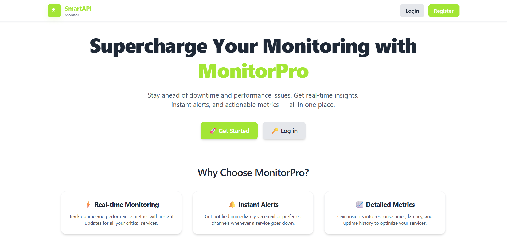
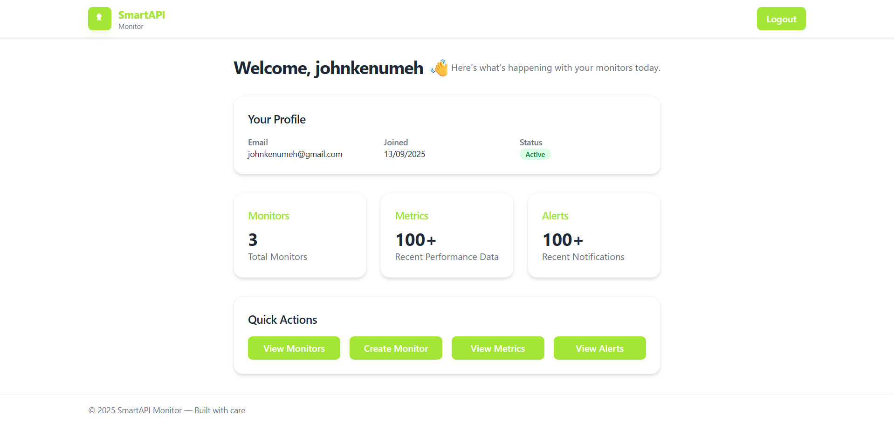
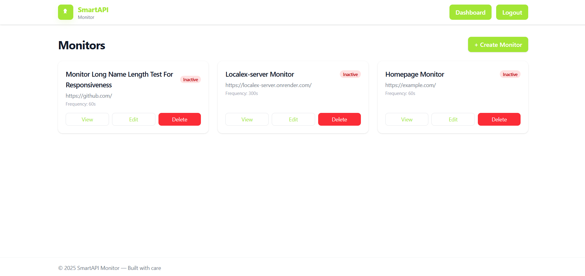
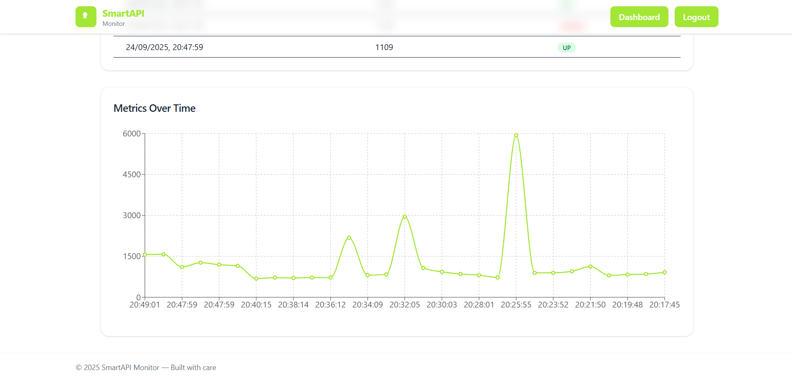
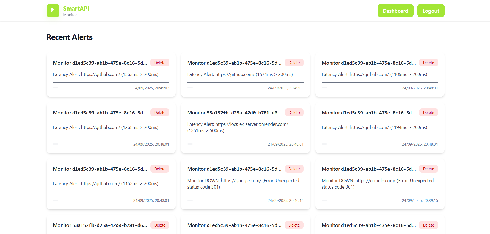

# 🌐 Smart API Monitor – Frontend

Smart API Monitor is a **modern, production-ready dashboard application** for tracking and monitoring APIs.  
It provides users with an intuitive interface to **manage monitors, view metrics, and receive alerts** in real time.  

This repository contains the **frontend codebase** built with **React + TypeScript**, designed to seamlessly interact with the Smart API Monitor backend service.

---

  

---

## ✨ Features

- 📊 **Monitor Management**
  - Create, update, and delete API monitors.
  - View details of each monitor.
- 📈 **Metrics Tracking**
  - Fetch and display API performance metrics.
  - Charts and visualization for top 10 metrics.
  - Auto-updating counts with `100+` cap for large datasets.
- 🔔 **Alerts System**
  - Display recent alerts triggered by monitor states.
  - Delete and manage alerts.
- 🏠 **Dashboard Overview**
  - Quick stats for monitors, metrics, and alerts.
  - Responsive design with cards and summaries.
- 🔐 **Authentication**
  - Secure login, logout, and registration flows.
  - Password visibility toggle.
  - Redirect to login after registration.
- 🖥️ **Responsive UI**
  - Fully mobile-friendly.
  - Scales across desktop, tablet, and large screens.
- ⚡ **Performance Optimizations**
  - Client-side caching with React Query.
  - Fast builds via Vite.

---

## 📸 Screenshots

### 🏠 Dashboard
  
*Overview with total monitors, metrics, and alerts.*

### 📈 Monitors
  
*All monitors - active and inactive.*

### 📈 Metrics
  
*Chart visualization for API metrics.*

### 🔔 Alerts
  
*Recent alerts list with delete support.*

---

## 🛠️ Tech Stack

- **Framework:** [React](https://reactjs.org/) + [Vite](https://vitejs.dev/)  
- **Language:** [TypeScript](https://www.typescriptlang.org/)  
- **State Management:** [React Query](https://tanstack.com/query) + Context API  
- **UI Styling:** [Tailwind CSS](https://tailwindcss.com/)  
- **Routing:** [React Router](https://reactrouter.com/)  
- **API Layer:** Axios client wrapper (`get`, `post`, `put`, `del`)  
- **Charts & Visualization:** [Recharts](https://recharts.org/)  

---

## 📂 Project Structure

```bash
├── src/
│   ├── App.tsx
│   ├── assets/
│   │   └── react.svg
│   ├── components/
│   │   ├── forms/
│   │   └── layout/
│   ├── hooks/
│   │   ├── index.ts
│   │   ├── useAdmin.ts
│   │   ├── useAlerts.ts
│   │   ├── useAuth.ts
│   │   ├── useMetrics.ts
│   │   └── useMonitors.ts
│   ├── index.css
│   ├── main.tsx
│   ├── pages/
│   │   ├── DashboardPage.tsx
│   │   ├── HomePage.tsx
│   │   ├── alerts/
│   │   ├── auth/
│   │   ├── metrics/
│   │   └── monitors/
│   ├── services/
│   │   ├── api.ts
│   │   └── client.ts
│   ├── types/
│   │   └── vite-env.d.ts
│   └── utils/
│       └── format.ts
```

---

## ⚙️ Getting Started

1. Clone the Repository
```bash
git clone https://github.com/Johnkenzzy/SmartApiMonitor-client.git
cd smart-api-monitor-frontend
```

2. Install Dependencies
```
npm install
```

3. Setup Environment Variables
- Create a .env file in the project root:
```bash
VITE_API_BASE_URL=http://localhost:8000/api
```

4. Run Development Server
```bash
npm run dev
```

---

## 📊 Core Workflows

- **Authentication**
  - **Register** → Redirect to login (no tokens returned on registration).
  - **Login** → Save access_token + refresh_token in localStorage.
  - **Logout** → Clear tokens and redirect to login.
- **Dashboard**
  - Displays total monitors, metrics, alerts.
  - If metrics/alerts > 100 → shows 100+.
- **Monitors**
  - Create, list, update, delete monitors.
- **Metrics**
  - Fetch and visualize metrics.
  - Chart of latest 10 entries.
- **Alerts**
  - List and delete alerts.
- **Responsive UI**
  - Works across mobile, tablet, and desktop screens.

  ---

## 🤝 Contributing

Contributions are welcome!
- Fork this repo
- Create a feature branch: git checkout -b feature/awesome-feature
- Commit changes: git commit -m 'Add new awesome feature'
- Push branch: git push origin feature/awesome-feature
- Open a Pull Request 🎉

---

##  📝 License
This project is licensed under the MIT License.

- Johnkennedy Umeh